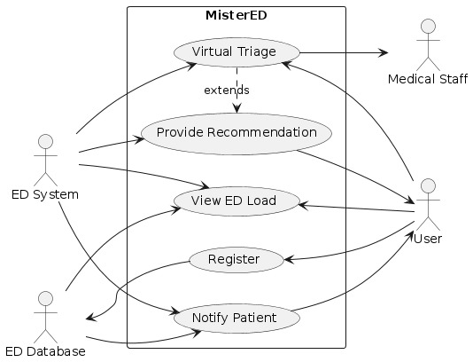

hello

**Figure 1:** A Use Case Diagram describing the Mister Ed system

## Use Cases

 Patient Registration Use Case (Tay Munro):
| **Use Case**      | Patient Registration |
|-------------------|-------------------------------|
| **Description**   | This use case allows a patient to register virtually using the Mister Ed system. The system collects patient details, validates the input, and registers the patient into the emergency department queue.|
| **Actors**        | Patient, Mister Ed System, ED Staff |
| **Assumptions**   | The patient has internet access, the system is online, and the patient can enter correct information. |
| **Steps**         | 1. Patient accesses Mister Ed System.  2. Patient provides personal details (name, age, symptoms, etc.).  3. Mister Ed validates patient details.  4. The patient is registered in the system |
| **Variations (Optional)** | 1. Patient already has an account and logs in instead of providing details.  2. Patient chooses not to proceed after seeing the current ED load.  3. System fails to validate patient details (e.g., incorrect or incomplete information). |
| **Non-Functional (Optional)** | 1. The system should handle at least 10,000 concurrent registrations without performance degradation.  2. Registration should take less than 2 minutes per patient. |
| **Issues**        | 1. How to handle patients with limited internet access.  2. Integrating with external triage systems.  3. Data security and patient privacy concerns. |

 Patient Virtual Triage Use Case (Lachlan Paulsen):
| **Use Case**      | Patient Virtual Triage |
|-------------------|-------------------------------|
| **Description**   | The Virtual Triage use case allows patients to input their symptoms into the MisterEd system. Based on this input, the system analyzes how urgent the patient's condition is. The system shall provide recommendations such as visiting the ED, visiting a GP, or waiting at home. This helps to mitigate ED congestion by providing patients with appropriate care suggestions for their condition.|
| **Actors**        |  Patient (Primary), Mister Ed System, Nurse | 
| **Assumptions**   | - The patient has an internet-connected device to access the Mister Ed system.  The system has access to up to date symptom triage protocols.   The patient's symptoms are accurately input into the system. |
| **Steps**         | 1. The patient logs into the Mister Ed system.   2. The patient enters symptoms through a questionnaire or input form.   3. The system uses predefined medical logic to assess the severity of the patient's symptoms.   4. Based on the analysis, the system provides the patient with a recommendation.   5. The patient can either follow the recommendation or contact a clinician for further advice. |
| **Variations (Optional)** | 1. If the patient’s symptoms are vague or unclear, the system may ask for additional details.   2. If the system cannot determine a clear outcome, it may notify a nurse or clinician for a manual review. |
| **Non-Functional (Optional)** | 	1. The system shall follow current privacy and data protection standards.   2. The system shall be responsive and scalable to handle large numbers of users at all times.   3. The system’s interface shall be user-friendly to ensure patients of all ages and technical skills can understand how to effectively use the system. |
| **Issues**        | 1. Risk of patients entering inaccurate information.   2. The system’s accuracy heavily depends on the quality of the medical logic used in the backend.|

 Provide Recommendation Use Case (Tristan Cornwell):
| Use Case                | Provide Recommendation                                                    |
|-------------------------|---------------------------------------------------------------------------|
| Description             | System interprets the results of a user's virtual triage and provides a recommendation to the user on how to proceed with treatment. |
| Actors                  | - Mister Ed System (primary)   - User   - Emergency Department Database |
| Assumptions             | - User has filled in all required information in the registration and virtual triage.   - User is logged in to the system. |
| Steps                   | 1. System acknowledges that it has received user information.   2. System starts searching for a nearby ED.   3. REPEAT   &nbsp;&nbsp;&nbsp;&nbsp;&nbsp;&nbsp; 3.1 System finds an ED within 40km of the user's address.   &nbsp;&nbsp;&nbsp;&nbsp;&nbsp;&nbsp; 3.2 System checks the estimated wait time for the ED.   &nbsp;&nbsp;&nbsp; UNTIL there are no more EDs within 40km of the user.   4. System displays the given EDs and their corresponding wait times to the user.   4. User selects their desired ED.   5. System places user in the queue for the chosen ED. | 
| Variations (Optional)   | #2: System suggests that the user visit a primary care clinic **or**   &nbsp;&nbsp;&nbsp;&nbsp;&nbsp; System suggests that the user take a particular over-the-counter medication **or**   &nbsp;&nbsp;&nbsp;&nbsp;&nbsp; System suggests that the user contact the nurse/clinician hotline over the phone or internet and provides &nbsp;&nbsp;&nbsp;&nbsp;&nbsp; a phone number and URL. |
| Non-Functional (Optional) | Performance: time to find nearby EDs or provide an alternative recommendation must be less than 15 seconds. |
| Issues                  | - What if there aren't any EDs close enough to the user? |

  Notify Patient Use Case (Luca Bolzonello):
| **Use Case**        | Notify Patient                                                                                                            |
|---------------------|---------------------------------------------------------------------------------------------------------------------------|
| **Description**     | This use case allows a user to choose their preferred notification method (Phone Call, Text). The user is notified when the ED is ready for them, with sufficient notice to arrive while there is still an opening. |
| **Actors**          | **Users**: Identified by "Virtual Triage" as safe to wait at home but should attend the ED. **Callers**: Employees who monitor the queue and call Users requesting Phone Call notifications. **Text Delivery System**: System that sends text notifications to Users requesting Text notifications. **ED Capacity Tracker**: Monitors ED activity, urgency, and commute time, flagging patients to be notified. |
| **Assumptions**     | - Virtual triage assesses patient urgency correctly. - ED Capacity Tracker matches urgency, capacity, and commute times to notify patients timely. - Users correctly enter their notification preferences. |
| **Steps**           | 1. Caller queries the ED Capacity Tracker for the next person to call. 2. Caller calls the User, informs them to go to the ED, confirms their attendance, and answers questions. |
| **Variations**      | 1. The Text Delivery System queries the ED Capacity Tracker for the next person to text. 2. The Text Delivery System sends a text notification to the User, informing them to go to the ED. |
| **Non-Functional**  | - Privacy - Robustness - Accessibility - Safety                                                                 |
| **Issues**          | How to ensure that Users always receive the notification.                                                                 |

 View ED Load Use Case (Paisley Lewis):
| Use Case           | View ED Load                                                                           |
|-------------------------|---------------------------------------------------------------------------|
| Use Case                | Understand the current load of EDs in the user's area                     |
| Description             | View capacity percentages and estimated wait times by emergency severity of nearby EDs. |
| Actors                  | -User (primary)   -Emergency Department Database   - MisterEd System              |
| Assumptions             | The user has inputted their location into the system so that nearby EDs can be found.   The user is logged into the MisterEd system. |
| Steps                   | 1. User selects ED of choice from a list of nearby EDs.   2. System loads waiting room and bed records from the ED database.   3. The system calculates capacity percentage from the number of ED beds currently in use.   4. The System calculates wait times by emergency severity from waiting room records.   5. The system displays calculated data.   6. User views data to make their decision about which ED to go to. |
| Non-Function            | Speed: The time to calculate and display data must be less than 5 seconds from the time the user selects the ED location.   Accuracy: Displayed estimated wait times must be within 10% of actual wait times. |
| Issues                  | What is the most accurate way to split emergency severity to calculate wait times? |

