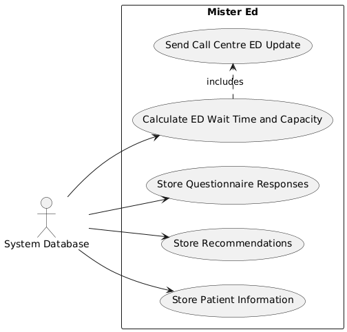

We split our Use Case Diagram into five smaller diagrams based on each use case's primary actor, as seen in the following sections.

## Admin Use Cases
Figure 1, below, outlines the use cases that may be executed by a system admin. Tables 1-5 describe each use case in more detail.

**Figure 1:** A Use Case Diagram describing the Mister Ed system from the perspective of the Admin actor.

 **Table 1**: Create User Profile Use Case.
| Use Case                | Create User Profile     |
|-------------------------|-------------------------|
| Description             | Create a system profile and configure system access for a medical staff member, call center operator, or admin.  |
| Actors                  | - Admin (primary) |
| Assumptions             | - Admin is logged in to the system. |
| Steps                   | 1. Generate a username by concatenating the user's first and last name, as well as a number representing the number of users currently in the system with that name.   2. Generate a temporary password.   3. Enter information about the user's position in their respective company (e.g., ED Nurse, ED Receptionist, Call Centre Manager).   4. Configure what parts of the system the user has access to.   5. Configure the level of patient information the user has access to.   6. Send an email to the user's provided email with their temporary password. | 
| Non-Functional          | **Security**: An admin must not be able to create a user with more access than themselves.   **Security**: An admin must enter their password before creating an account. |
| Issues                  | - What if a user quits or is fired? |

 **Table 2**: View User Profile Use Case.
| Use Case                | View User Profile     |
|-------------------------|-------------------------|
| Description             | View the system profile of a medical staff member, call center operator, or admin. |
| Actors                  | - Admin (primary) |
| Assumptions             | - Admin is logged in to the system.   - User profile has already been created. |
| Steps                   | 1. Search for a user by username, position, or company.   2. Click on the user to view the user's profile. | 
| Non-Functional          | **Security**: User password must be obfuscated.   **Efficiency**: Search results must appear within 5 seconds. |
| Issues                  | - What if the system fails to match any user to a given search? |

 **Table 3**: Modify User Profile Use Case.
| Use Case Extension      | Modify User Profile *extends* View User Profile |
|-------------------------|-------------------------|
| Description             | Admin decides to edit a profile that they are currently viewing. |
| Steps                   | 1. Click the "Edit" button to edit the user's profile.   2. Make the desired changes.   3. Click the "Save" button to confirm the changes. | 
| Non-Functional          | **Security**: An admin must not be able to modify a user's password. |
| Issues                  | - What if someone needs a history of who has modified a given user's profile? |

 **Table 4**: View User Access Use Case.
| Use Case Extension      | View User Access *extends* View User Profile |
|-------------------------|-------------------------|
| Description             | Admin decides to view the system access for a profile that they are currently viewing. |
| Steps                   | 1. Click on the "Access" button to view the user's access to all parts of the system. |
| Issues                  | - What if a user has an account with no access to any part of the system? |

 **Table 5**: Modify User Access Use Case.
| Use Case Extension      | Modify User Access *extends* View User Access |
|-------------------------|-------------------------|
| Description             | Admin decides to modify the system access for a profile that they are currently viewing. |
| Steps                   | 1. Click the "Edit" button to edit the user's access.   2. Make the desired changes.   3. Click the "Save" button to confirm the changes. | 
| Non-Functional          | **Security**: An admin must not be able to grant or revoke access that they themselves do not have. |
| Issues                  | - What if the admin attempts to modify their own access, or that of another admin? |

## Medical Staff Use Cases
Figure 2, below, outlines the use cases that may be followed by medical staff when using the system. Tables 6-9 describe each use case in more detail.

**Figure 2:** A Use Case Diagram describing the Mister Ed system from the perspective of the Medical Staff actor.

 **Table 6**: Review Symptoms.
| Use Case                | Review Symptoms    |
|-------------------------|-------------------------|
| Description             |  |
| Actors                  | - Medical Staff (primary) |
| Assumptions             | -  |
| Steps                   | 1.  | 
| Variations (Optional)   | #1: |
| Non-Functional (Optional) | **Security**:  |
| Issues                  | -  |

 **Table 7**: View Patient Medical History.
| Use Case                | View Patient Medical History    |
|-------------------------|-------------------------|
| Description             |  |
| Actors                  | - Medical Staff (primary) |
| Assumptions             | -  |
| Steps                   | 1.  | 
| Variations (Optional)   | #1: |
| Non-Functional (Optional) | **Security**:  |
| Issues                  | -  |

 **Table 8**: Make Recommendation.
| Use Case                | Make Recommendation     |
|-------------------------|-------------------------|
| Description             |  |
| Actors                  | - Medical Staff (primary) |
| Assumptions             | -  |
| Steps                   | 1.  | 
| Variations (Optional)   | #1: |
| Non-Functional (Optional) | **Security**:  |
| Issues                  | -  |

 **Table 6**: View Triage Queue.
| Use Case                | View Triage Queue    |
|-------------------------|-------------------------|
| Description             |  |
| Actors                  | - Medical Staff (primary) |
| Assumptions             | -  |
| Steps                   | 1.  | 
| Variations (Optional)   | #1: |
| Non-Functional (Optional) | **Security**:  |
| Issues                  | -  |

## System Database Use Cases
Figure 5, below, outlines the use cases that may be executed by the system database. Tables x-x describe each use case in more detail.

**Figure 5:** A Use Case Diagram describing the Mister Ed system from the perspective of the System Database actor.

 **Table x**: Store Patient Information Use Case.
| Use Case                | Store Patient Information     |
|-------------------------|-------------------------|
| Description             | Store any information inputted by a patient for later reference. |
| Actors                  | - System Database (primary)   - Patient |
| Assumptions             | - Patient does not yet have an account.   - Patient has an internet connection. |
| Steps                   | 1. Patient provides their Name, Contact Information, Username, Password, and Personal Health Number during account creation.   2. The provided encrypted information is passed to the system database.    3. The database decrypts the information.   4. A new entry is created in the accounts table in the database.   5. The patient information is stored in that entry. | 
| Non-Functional  | **Security**: The data provided is sensitive and must be encrypted so that it cannot be intercepted and read. |
| Issues                  | What if the patient does not provide all the required information fields? |

 **Table x**: Store Questionnaire Responses Use Case.
| Use Case                | Store Questionnaire Responses     |
|-------------------------|-------------------------|
| Description             | Store any responses to the triage questionnaire from the patient in the system database. |
| Actors                  | - System Database (primary) |
| Assumptions             | - Patient has an account.   - The patient has just submitted a triage questionnaire.   - Patient has an internet connection. |
| Steps                   | 1. The provided encrypted questionnaire questions and answers are passed to the system database.    3. The database decrypts the information. 4. A new entry is created in the questionnaire table in the database.   5. The patient username is used as the key and each response to a question is stored in a separate column. | 
| Non-Functional  | **Security**: The data provided is sensitive and must be encrypted so that it cannot be intercepted and read. |
| Issues                  | What if the patient does not answer all questions? |

 **Table x**: Store Reccomendations Responses Use Case.
| Use Case                | Store Reccomendations Responses     |
|-------------------------|-------------------------|
| Description             | Store any recommendation results to the patient triage questionnaire in the system database. |
| Actors                  | - System Database (primary) |
| Assumptions             | - The patient has an account.   The patient has submitted a triage questionnaire.   - Mister Ed system or Medical Professional have submitted recommendations. |
| Steps                   | 1. The provided encrypted recommendations are passed to the system database.    3. The database decrypts the information. 4. A new entry is created in the recommendation table in the database.   5. The patient username and questionnaire ID are used as the key and the recommendation and source of recommendation are stored in that entry. | 
| Non-Functional  | **Security**: The data provided is sensitive and must be encrypted so that it cannot be intercepted and read. |
| Issues                  | What if the recommendation came from a Medical Professional, should their name be added to the database entry? |

 **Table x**: Calculate ED Wait Time and Capacity Use Case.
| Use Case                | Calculate ED Wait Time and Capacity     |
|-------------------------|-------------------------|
| Description             | Calculate an ED's current wait time and capacity percentage from waiting room records. |
| Actors                  | - System Database (primary)   |
| Assumptions             | - System Database waiting room records have been recently updated. |
| Steps                   | 1. Pick ED to perform calculations for based off request or timeout.   2. From the ED table get the number of beds in use and the number of total beds to get ED capacity.    3. From the ED table get the number of medical staff currently working and the ED capacity percentage to calculate wait time based on emergency severity. 4. Update ED table capacity percentage and wait time columns.   5. Update timeout timestamp. | 
| Non-Functional  | **Efficency**: The time to perform calculations and save data must be less than 5 seconds.   **Accuracy**: Displayed estimated wait times must be within 10% of actual wait times. |
| Issues                  | What is the most accurate way to split emergency severity to calculate wait times? |

 **Table x**: Send Call Centre ED Update Use Case.
| Use Case Inclusion       | Calculate ED Wait Time and Capacity *includes* Send Call Centre ED Update    |
|-------------------------|-------------------------|
| Description             | Send calculated ED capacity percentage and wait time information to the call centre so they can notify the next patients on the waiting list. |
| Actors                  | - System Database (primary) |
| Assumptions             | - ED calculations have just been performed and saved in the System Database. |
| Steps                   | 1. Database collects ED Name, Capacity Percentage, and Wait Time.   2. The information is encrypted for transmission.    3. The database transmits the information to the Call Centre. | 
| Non-Functional  | **Security**: The patient data provided is sensitive and must be encrypted so that it cannot be intercepted and read. |
| Issues                  | What if the call centre does not want constant updates? |

## Patient Use Cases
Figure X, below, outlines the use cases that may be executed by a patient using the system. Tables 1-5 describe each use case in more detail.

**Figure x:** A Use Case Diagram describing the Mister Ed system from the perspective of the Patient actor.

 **Table x**: Register/Login Use Case.
| Use Case                | Register/Login     |
|-------------------------|-------------------------|
| Description             | The patient registers if they are a first time user or logs into the Mister Ed system using their credentials. This ensures secure access to the system. |
| Actors                  | - Patient (primary) |
| Assumptions             | - The patient has access to a device that is connected to the internet.  - The system securely stores patients' login credentials.|
| Steps                   | 1. The patient opens the Mister Ed system.  2. The patient either enters their login credentials or creates a new account.   3. If creating a new account, the patient fills out the necessary details.   4. The system authenticates the patient’s credentials.  5. The patient successfully gains access to the system. | 
| Variations (Optional)   | #2 The patient may opt for a password reset if they forget their credentials. |
| Non-Functional (Optional) | **Security**: The login system must adhere to data privacy regulations and ensure secure encryption. |
| Issues                  | - Forgotten credentials or system errors during login.  |

 **Table x**: View ED Load Use Case.
| Use Case                | View ED Load     |
|-------------------------|-------------------------|
| Description             |  The patient views the current load of emergency departments in their location, helping them choose the facility with the shortest wait time.|
| Actors                  | - Patient (primary) |
| Assumptions             | - The system has accurate data on ED load.  - The patient is already logged into the system. |
| Steps                   | 1. The patient selects the option to view ED load.   2. The system displays a list of nearby EDs with the current load.   3. The patient views the information and decides what ED to visit based on the load. | 
| Variations (Optional)   |  |
| Non-Functional (Optional) | **Security**: The system must provide data in real time on the current ED load. |
| Issues                  | - System may delay in providing ED load updates |

 **Table x**: Enter Symptom Information Use Case.
| Use Case                | Enter Symptom Information    |
|-------------------------|-------------------------|
| Description             | The patient enters their symptoms into the system for a virtual triage to determine the urgency of their condition. |
| Actors                  | - Patient (primary) |
| Assumptions             | -The patient enters their symptoms accurately.  |
| Steps                   |1. The patient selects the option to enter symptom information.  2. The system provides the patient with a questionnaire to gather medical details.   3. The patient inputs their symptoms.   4. The system stores this information for analysis.  | 
| Variations (Optional)   |  |
| Non-Functional (Optional) | - The system must be intuitive and simple to use for all users. |
| Issues                  | - Patients may provide vague or inaccurate information, which will affect the virtual triage result.  |

 **Table x**: View Treatment Options Use Case.
| Use Case                | View Treatment Options |
|-------------------------|-------------------------|
| Description             | The patient can view treatment options based on their symptoms. The system will recommend visiting an ED, going to a general practitioner (GP), or staying at home. |
| Actors                  | - Patient (primary) |
| Assumptions             | - The patient has completed symptom input. |
| Steps                   | 1. After entering symptoms, the patient views suggested treatment options.   2. The system displays recommendations based on the severity of the condition.   3. The patient reviews and selects the appropriate option. | 
| Variations (Optional)   |  |
| Non-Functional (Optional) | - The treatment recommendations must be based on up to date medical standards and guidelines. |
| Issues                  | - Patients may not follow system recommendations.  |

 **Table x**: Enter ED Queue Use Case.
| Use Case                | Enter ED Queue    |
|-------------------------|-------------------------|
| Description             | The patient enters the queue for an ED if the system recommends this action. The patient can wait at home until it is their turn. |
| Actors                  | - Patient (primary) |
| Assumptions             | - The system accurately assesses the ED load and provides a reasonable waiting time.  |
| Steps                   | 1. The patient decides to enter the ED queue based on the system recommendation.   2. The system assigns the patient a place in the queue and provides an estimated wait time.   3. The patient waits at home and receives a notification when it is their turn to visit the ED. | 
| Variations (Optional)   | |
| Non-Functional (Optional) |- The system must be accurate in estimating waiting times to avoid overcrowding at the ED. |
| Issues                  | - Delays in the system notifying the patient could cause issues with estimated ED wait times. |

## Call Center Use Cases

Figure x, below, outlines the use cases that may be executed by the Call Center. Tables x-x describe each use case in more detail.

**Figure 5:** A Use Case Diagram describing the Mister Ed system from the perspective of the Call Center actor.

 **Table x**: ViewQueue Use Case.
| **Use Case**        | View Queue |
|---------------------|---------------------------------------------------------------------------------------------------------------------------|
| **Description**     |  View the queue of patients that have requested notification. |
| **Actors**          | - CallCenterEmployee (primary)
| **Assumptions**     | - CallCenterEmployee is logged in.   - CallCenterEmployee has correct permissions to view the patient queue.|
| **Steps**    | 1. CallCenterEmployee selects the "View Queue" option.   2. The CallCenterEmployee is shown the patient queue.|
| **Non-Functional**  |     **Efficency**: Queue must load and be shown to the CallCenterEmployee in under 3 seconds.                                                         |
| **Issues**          |   What happens if the queue is empty?      |

 **Table x**: ViewPatientInfo Use Case.
| **Use Case**        | ViewPatientInfo|
|---------------------|---------------------------------------------------------------------------------------------------------------------------|
| **Description**     |  View the information page for the currently selected patient. |
| **Actors**          | - CallCenterEmployee (primary)
| **Assumptions**     | - CallCenterEmployee is currently viewing the queue.   - CallCenterEmployee has correct permissions to view the patient information page.|
| **Steps**           | 1. CallCenterEmpoloyee selects a patient from the queue.   2. CallCenterEmployee and chooses "View Info".   3. CallCenterEmployee is shown the patients information page. |
| **Non-Functional**  |    **Traceability**: Must track and log who views the information page for each patient. |
| **Issues**          |                                                                |

 **Table x**: CallPatient Use Case.
| **Use Case**        | CallPatient|
|---------------------|---------------------------------------------------------------------------------------------------------------------------|
| **Description**     |  Call the patient and inform them that there is a spot in the ED available to them. |
| **Actors**          | - CallCenterEmployee (primary)   - Patient
| **Assumptions**     | - CallCenterEmployee is currently viewing the patient information page.  - Assume that Patient picks up.   Patient hasn't changed their mind about going to the  ED.|
| **Steps**           | 1. CallCenterEmployee clicks on "Call Patient".   2. Call is sent to the Patient.   3. CallCenterEmployee informs the patient that there is a spot available in the ED for them.   4. Patient confirms that they will be going into the ED. |
| **Non-Functional**  |   **Privacy**: Must verify that the person on the phone is the Patient before discussing medical information.                                                      |
| **Issues**          |      What happens if the Patient doesn't pick up?                                                          |

 **Table x**: NotifyED Use Case.
| **Use Case**        | NotifyED|
|---------------------|---------------------------------------------------------------------------------------------------------------------------|
| **Description**     |  Notify the ED that a patient will be coming in. |
| **Actors**          | - CallCenterEmployee (primary)
| **Assumptions**     | - The CallCenterEmployee is currently viewing the Patient information page.   - The patient has been called and confirmed that they will be going into the ED.|
| **Steps**           | 1. CallCenterEmployee clicks the "Notify ED" button.   2. Notification is sent out to the ED that the Patient will be coming in.  |
| **Non-Functional**  |     **Security**: Data is sensitive and must be encrypted and sent over a secure communication network.   **Efficiency**: Process is time sensitive and notification must be sent to the ED within 10 seconds.                                         |
| **Issues**          |  How to forward Patient information to the ED?                                                              |

